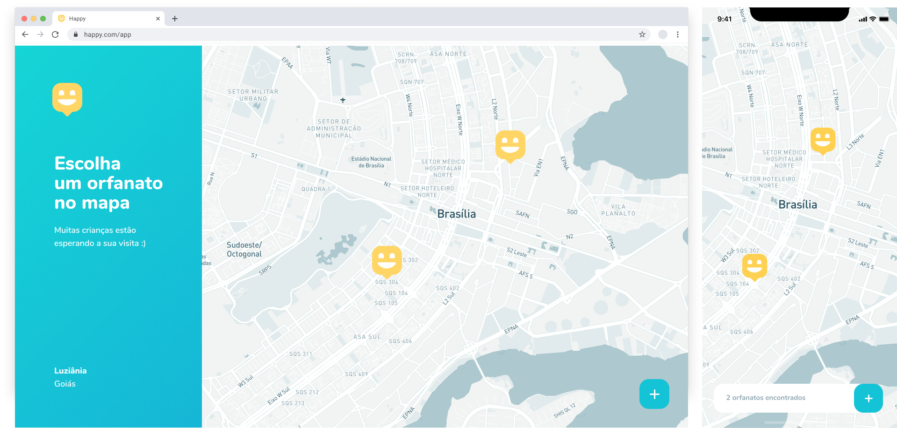

<h1 align="center">
  
  <br />
</h1>
<p align="center">
  <a href="#page_facing_up-descrição">Descrição</a>&nbsp;&nbsp;&nbsp;|&nbsp;&nbsp;&nbsp;
  <a href="#paperclip-links">Links</a>&nbsp;&nbsp;&nbsp;|&nbsp;&nbsp;&nbsp;
  <a href="#-tecnologias">Tecnologias</a>&nbsp;&nbsp;&nbsp;|&nbsp;&nbsp;&nbsp;
  <a href="#clipboard-Funcionalidades">Funcionalidades</a>&nbsp;&nbsp;&nbsp;|&nbsp;&nbsp;&nbsp;
  <a href="#closed_book-instalação">Instalação</a>&nbsp;&nbsp;&nbsp;|&nbsp;&nbsp;&nbsp;
  <a href="#man-Autor">Autor</a>&nbsp;&nbsp;&nbsp;|&nbsp;&nbsp;&nbsp;
  <a href="#memo-Licença">Licença</a>
</p>



## :page_facing_up: Descrição
Na Next Level Week #3 by @Rocketseat, criamos esta aplicação chamada Happy, que conecta as pessoas a casas de acolhimento institucional para fazer o dia de muitas crianças mais feliz. Durante essa semana criamos o Backend, Frontend e o app Mobile, foi uma semana intensa com muito apredizado e mão no código, para alcançar o próximo nível :rocket:

## :paperclip: Links
Nos links abaixo você encontra o Layout da versão Web e a versão Mobile, também um link para o google drive da Workspace do Insomnia, caso você queira testar a API.

- [Layout Web](https://www.figma.com/file/mDEbnoojksG4w8sOxmudh3/Happy-Web?node-id=0%3A1)
- [Layout Mobile](https://www.figma.com/file/X27FfVxAgy9f5IFa7ONlph/Happy-Mobile?node-id=0%3A1)
- [Workspace Insomnia](https://drive.google.com/file/d/1wTJnyg-1pjkz-RJUTS4ioyUfZHGZqNdP/view?usp=sharing)

## 🛠 Tecnologias
Este projeto foi desenvolvido com as seguintes tecnologias

- [Node.js](https://nodejs.org/en/)
- [React.js](https://pt-br.reactjs.org/)
- [React Native](https://reactnative.dev/)
- [TypeScript](https://www.typescriptlang.org/)
- [TypeORM](https://typeorm.io/#/)
- [Postgresql](https://www.postgresql.org/)
- [Expo](https://expo.io/)
- [StyledComponents](https://styled-components.com/)

## :clipboard: Funcionalidades
- [x] Visualizar todas as casas de acolhimento institucional cadastrados na aplicação.
- [x] Ver detalhes de cada casa de acolhimento institucional.
- [x] Criar uma casa de acolhimento institucional.

## :closed_book: Instalação

### Pré-requisitos
Antes de começar, você vai precisar ter instalado em sua máquina as seguintes ferramentas:
[Git](https://git-scm.com), [Node.js](https://nodejs.org/en/), [Expo](https://expo.io/) instalado no seu celular ou emulador.
Além disto é bom ter um editor para trabalhar com o código como [VSCode](https://code.visualstudio.com/)

### 🎲 Rodando o Back End

```bash
# Clone este repositório
$ git clone https://github.com/alexandredev3/happy-nlw3.git

# Vá para a pasta backend
$ cd backend

# Instale as dependências
$ yarn

# Execute a API
$ yarn dev

# O servidor inciará na porta 3333 - url <http://localhost:3333>
```

### 💻️ Rodando o Front End

```bash
# Vá para a pasta web
$ cd web

# Instale as dependências
$ yarn

# Execute aplicação
yarn start

# O app vai está rodando na porta 3000 - acesse <http://localhost:3000>
```

### 📱️ Rodando o Mobile

```bash
# Vá para a pasta mobile
$ cd mobile

# Instale as dependências
$ yarn

# Execute aplicação
yarn start

# Com esse comando irá abrir uma aba no seu navegador com um QR CODE.
# No seu celular(ou emulador) abre o aplicativo do Expo, e escaneie o QR CODE.
```

## :man: Autor

<a href="https://github.com/FeSilva-dev">
 
 <br />
 <sub><b>Felipe Silva</b></sub>
</a>


Feito com carinho por Felipe Silva :wave::wave: Entre em contato!🚀


## :memo: Licença

Copyright © 2020 [Felipe Silva](https://github.com/FeSilva-dev).<br />
This project is [MIT](./LICENSE.txt) licensed.
